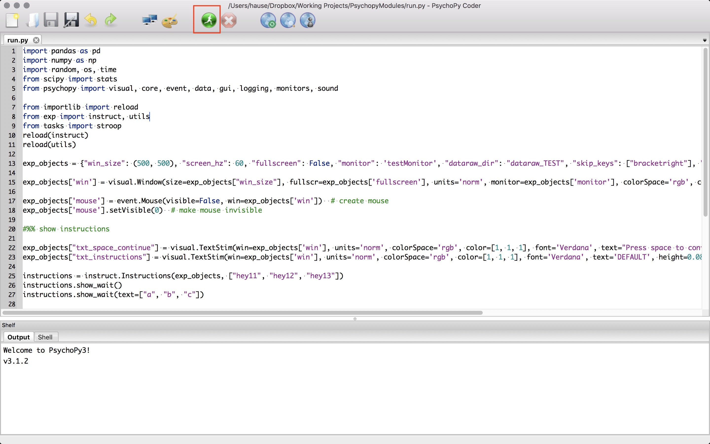

# exp for psychopy

Tested in the following PsychoPy versions: **3.1.2**

`exp`: modules for running experiments/tasks

`extra`: other stuff not required for the library

`stimuli`: stimuli (e.g., csv files, images) for different tasks

`tasks`: modules for running different tasks

`run.py`: main python file to run experiments contained in `tasks`

## How to run tasks in PsychoPy coder?

Open PsychoPy coder, load the `run.py` file in coder, and click the green icon to run the task.

